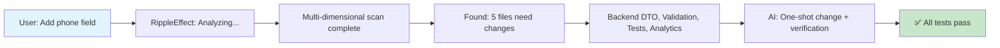

# 🌊 RippleEffect

<div align="center">

**Systematically prevent dependency chain breakage from code changes**

*Multi-dimensional dependency analysis for AI code assistants*

[](https://opencode.ai/)
[](SKILL.md)
[](LICENSE)

</div>

---

## 📖 Overview

RippleEffect is an OpenCode Agent Skill that prevents dependency chain breakage during code modifications. It performs **multi-dimensional dependency analysis** before making changes, ensuring all affected layers are identified and synchronized.

When you need to modify code, RippleEffect analyzes:
- 🔗 **Code References** - Who calls this function/class
- 📊 **Data Flows** - Who consumes this data's output  
- 📝 **Contract Dependencies** - Who depends on this interface format
- ⚙️ **Configuration Dependencies** - Who uses this configuration
- 🌐 **Frontend-Backend Consistency** - API/format alignment

---

## 🚨 The Problem


Traditional code modification workflow:
1. Modify one file
2. Discover broken dependencies
3. Fix one dependency at a time
4. Repeat until everything works
5. **Hours wasted on cascading fixes**

---

## ✨ The Solution



RippleEffect workflow:
1. Receive modification request
2. Perform multi-dimensional dependency analysis
3. Generate complete change plan
4. Execute all changes atomically
5. Verify everything works
6. **Done in minutes, not hours**

---

## 🎯 Key Features

| Feature | Description |
|---------|-------------|
| **Multi-Dimensional Analysis** | Analyzes code references, data flows, contracts, and configurations |
| **Implicit Dependency Detection** | Identifies dependencies without direct imports |
| **Frontend-Backend Consistency** | Validates API routes, formats, types, and validation rules |
| **Complete Change Plans** | Generates all affected locations before modification |
| **Atomic Execution** | Executes all changes at once to prevent partial updates |
| **Verification Integration** | Runs diagnostics and tests after changes |

---

## 📦 Installation

### Option 1: Local Installation (Recommended)

```bash
# Clone this skill to your OpenCode skills directory
git clone https://github.com/YOUR_USERNAME/ripple-effect.git \
  ~/.config/opencode/skills/ripple-effect
```

### Option 2: For OpenCode Plugin Development

```bash
# If you're contributing to opencode-agent-skills
cd /path/to/opencode-agent-skills
mkdir -p .opencode/skills/ripple-effect
# Copy SKILL.md to this directory
```

### Option 3: Import as Project Skill

Create `.opencode/skills/ripple-effect/SKILL.md` in your project repository.

---

## 🚀 Usage

### Automatic Activation

RippleEffect automatically activates when you request any code modification:

```
User: "Add a phone number field to the user profile"
      ↓
RippleEffect: (Activates automatically)
      ↓
Multi-dimensional dependency analysis
      ↓
Complete change plan generated
      ↓
All affected files modified
      ↓
Verification completed
```

### Manual Activation

```bash
use_skill ripple-effect
```

---

## 📊 Multi-Dimensional Framework

### Dimension 1: Code Reference Dependencies

```typescript
// Target: updateUserProfile(user: UserInput)
// Analysis: lsp_find_references

// Found 4 direct references:
├── user.service.ts:42
├── admin.controller.ts:15
├── user.controller.spec.ts:89
└── audit.logger.ts:23
```

### Dimension 2: Data Flow Dependencies

```typescript
// Target: UserSerializer.toJSON()
// Analysis: Track data producer → consumer

// Found implicit dependencies:
UserInput 
  → UserSerializer.toJSON() 
    → AnalyticsService.process()    // ⚠️ No direct import!
    → ReportGenerator.export()      // ⚠️ No direct import!
```

### Dimension 3: Contract Dependencies

```typescript
// Target: API interface changes
// Analysis: Check frontend-backend alignment

// Frontend: POST /api/users { name, email, phone }
// Backend:  PUT /users/:id { name, email }  ← Inconsistency!
```

### Dimension 4: Frontend-Backend Consistency

| Check | Frontend | Backend | Status |
|-------|----------|---------|--------|
| Route | `/api/users/{id}` | `/users/:id` | ✅ Match |
| Body | `{ name, email, phone }` | `{ name, email }` | ❌ Missing |
| Validation | `phone.required()` | None | ❌ Missing |
| Type | `UserInput` | `UpdateUserDTO` | ❌ Missing |

---

## 💡 Example Scenarios

### Scenario 1: Adding a New Field

**Request**: "Add phone number to user registration form"

**RippleEffect Analysis**:
```
Code References: 3 locations
Data Flows: 2 implicit dependencies  
Contract Dependencies: 6 locations
Frontend-Backend: 3 inconsistencies found

Complete Change List (11 items):
├── Backend DTO: add phone field
├── Backend validation: add phone.required()
├── UserSerializer: serialize phone
├── AnalyticsService: adapt to new field
├── OpenAPI spec: update contract
├── Test data: update mock inputs
└── ... (5 more)
```

### Scenario 2: Modifying a Function Signature

**Request**: "Change calculateTotal() to accept currency parameter"

**RippleEffect Analysis**:
```
Direct Callers: 5 functions
Indirect Callers: 12 modules
Data Consumers: 3 services

Impact Assessment:
- High: 3 modules need signature updates
- Medium: 5 modules need logic adaptation
- Low: 2 modules use defaults

Recommended: Option A (synchronize all)
```

---

## 🛠️ Tool Integration

| Tool | Purpose |
|------|---------|
| `lsp_find_references` | Find all code references |
| `lsp_symbols` | View workspace symbols and exports |
| `lsp_rename` | Safely rename symbols across codebase |
| `grep` | Search for patterns and imports |
| `lsp_diagnostics` | Verify changes after execution |
| `ast_grep_search` | Advanced pattern matching |

---

## 📋 Consistency Checklist

When modifying frontend-backend code, RippleEffect validates:

- [ ] **Route Consistency** - Paths and HTTP methods match
- [ ] **Request Format** - Body fields align
- [ ] **Response Format** - Data structures match
- [ ] **Status Codes** - Error handling aligned
- [ ] **Validation Rules** - Frontend/backend validation consistent
- [ ] **Business Logic** - Calculations and rules match

---

## 📖 Documentation

For detailed usage guide, see:

- **[SKILL.md](SKILL.md)** - Complete skill documentation
- **[EXAMPLES.md](EXAMPLES.md)** - Real-world usage examples
- **[CHANGELOG.md](CHANGELOG.md)** - Version history

---

## 🤝 Contributing

Contributions are welcome! Please read our [Contributing Guide](CONTRIBUTING.md) for details.

### Ways to Contribute

- 🐛 Report bugs
- 💡 Suggest new features
- 📝 Improve documentation
- 🔧 Submit pull requests
- ⭐ Star this repository

---

## 📝 License

This project is licensed under the MIT License - see the [LICENSE](LICENSE) file for details.

---


---

<div align="center">

**Made with ❤️ for developers who care about code quality**

*Because changing one line should never break another*

</div>
