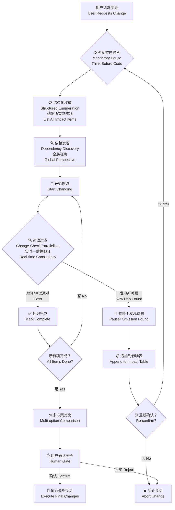

<p align="center">
  
</p>

<h1 align="center" style="font-weight: 300; letter-spacing: -0.5px;">
  Socratic-Method Skill
</h1>

<p align="center" style="color: #86868B; font-size: 21px; line-height: 1.5;">
  让 AI 像高级程序员一样工作：先想后写，边改边查<br>
  <em>Make AI work like a senior dev: think first, check while coding</em>
</p>

<p align="center">
  <a href="#-核心机制--core-mechanism">核心机制 | Core Mechanism</a> ·
  <a href="#-快速开始--quick-start">快速开始 | Quick Start</a> ·
  <a href="#-为什么必用--why-mandatory">为什么必用 | Why Mandatory</a> ·
  <a href="#-工作原理--how-it-works">工作原理 | How It Works</a> ·
  <a href="#-配置指南--configuration">配置指南 | Configuration</a>
</p>

---

## 🧠 核心机制 | Core Mechanism

<div align="center">

| 机制 Mechanism | 解决的问题 Problem Solved | 与传统 AI 的区别 Difference from Traditional AI |
|:---|:---|:---|
| **强制暂停思考<br>Mandatory Pause & Think** | AI 埋头苦写，不顾关联影响<br>AI codes blindly, ignoring dependencies | **像高级程序员一样工作<br>Work like a senior dev**：改前先想谁会受影响<br>Think who will be affected before changing |
| **边改边查<br>Change-Check Parallelism** | 改完 A、B、C 才发现小 E 报错<br>Finish A,B,C then find E broken | **实时一致性检查<br>Real-time consistency check**：每改一处立即验证关联<br>Verify dependencies immediately with every change |
| **结构化枚举<br>Structured Enumeration** | 口头说"我考虑了"但遗漏关键点<br>Verbally "considered" but missed key points | **表格化强制列出<br>Tabulated mandatory listing**：必须列出所有影响项<br>Must list all impact items in table |
| **多方案对比<br>Options & Trade-offs** | 只给单一路径，无备选方案<br>Single path without alternatives | **强制提供 2-3 种方案<br>Mandatory 2-3 alternatives**：附风险评估与推荐<br>With risk assessment & recommendation |
| **用户确认关卡<br>Human Gate** | 自动执行后才发现问题<br>Auto-execute then problems emerge | **确认后才执行<br>Confirm then execute**：用户不点头，代码不动<br>User confirmation required before any edit |
| **动态发现即停<br>Dynamic Discovery Pause** | 改着改着发现新依赖，已无法回头<br>New dependencies found mid-edit, irreversible | **增量确认<br>Incremental confirmation**：发现新影响立即暂停重确认<br>Pause & re-confirm when new impact found |

</div>

---

## 🚀 快速开始 | Quick Start

### 支持的 AI Agent | Supported Agents

<p align="center">
  
  
  
  
</p>

### 安装 | Installation

<details>
<summary><b>🤖 为 AI Agent 配置 | Configure for AI Agents</b></summary>

将以下内容添加到 Agent 的系统提示或技能目录：<br>
Add the following to your Agent's system prompt or skill directory:

```markdown
---
name: socratic-method
description: Force an impact-aware workflow for any code or configuration change. 
             Use whenever modifying code, configs, schemas, APIs, or refactoring.
             Always require listing dependent modules, call sites, tests, interfaces, 
             and external integrations that could be affected, propose solutions for 
             each item, and ask the user to confirm whether to change them together.
---
```

**Cursor**: 放入 `.cursor/rules/` 目录 | Place in `.cursor/rules/` directory  
**Codex**: 添加到 `codex.md` 或技能库 | Add to `codex.md` or skill library  
**OpenCode**: 配置为系统级 Skill | Configure as system-level Skill  
**Claude Code**: 放入 `.claude/` 目录或全局配置 | Place in `.claude/` directory or global config

</details>

---

## 🎯 为什么必用？| Why Mandatory?

### 这不是建议，是硬约束 | This is Hard Constraint, Not Advice

**普通 AI 的问题 | The Problem with Regular AI：**

> "请帮我改这个功能" → AI 埋头苦写 300 行，改完 A、B、C，提交时发现小 E 爆红了<br>
> *"Please modify this feature"* → AI blindly codes 300 lines, changes A,B,C, submits then E explodes

**Socratic Method 的解决方案 | The Solution：**

```
用户：改一下这个函数
User: Modify this function

AI（像高级程序员一样思考）：
AI (Thinking like a senior dev):

"好，我要改 getUser。先别急着动手，让我看看谁会受影响..."
"Okay, I need to change getUser. Don't rush, let me see who will be affected..."

1. 全局搜索调用方（思考关联）
   Global search for callers (thinking about dependencies)
   → 发现 5 处调用：auth.ts, billing.ts, profile.tsx, admin.ts, test-utils.ts

2. 分析影响面（评估风险）
   Analyze impact scope (assessing risks)
   → auth 和 billing 是核心支付流程，不能崩
   → profile.tsx 是前端组件，需要同步改
   → test-utils 是测试基座，改了要重跑全量测试

3. 边改边检查（实时一致性）
   Change while checking (real-time consistency)
   ✅ auth.ts - 改为 async，编译通过
   ✅ billing.ts - 改为 async，编译通过
   ⚠️ profile.tsx - 发现类组件，不能用 await，需要重构为函数组件
   ⏸️ 暂停！发现新关联项，需要重新评估范围

4. 制定方案（提供选择）
   Formulate options (providing choices)
   → 方案 A：全面重构（推荐）
   → 方案 B：兼容层过渡
   → 方案 C：仅后端修改（风险高）

5. 等待确认（不擅自行动）
   Wait for confirmation (no unauthorized action)
   → 用户确认方案 A 和范围后，才继续执行
```

### 谁需要这个 Skill？| Who Needs This Skill？

| 用户类型 User Type | 痛点 Pain Point | 本 Skill 的价值 Value |
|:---|:---|:---|
| **Vibe Coding 新手<br>Vibe Coding Beginners** | 刚学会让 AI 写代码，但不敢放手，怕改崩项目<br>Just learned AI coding, afraid to let go, fear of breaking project | **放心交给 Agent**：一致性检查自动捕获遗漏，新手也能大胆委托<br>**Confidently delegate to Agent**: Automatic consistency checks catch omissions, beginners can delegate boldly |
| **经验丰富的程序员<br>Experienced Programmers** | 知道 AI 会遗漏关联项，每次都要手动检查，费时费力<br>Know AI misses dependencies, manual checking every time is tedious | **省心托管**：AI 像资深同事一样帮你把关，你只需要做决策<br>**Worry-free delegation**: AI acts like a senior colleague reviewing for you, you just make decisions |
| **大型项目维护者<br>Large Project Maintainers** | 代码库复杂，牵一发而动全身，AI 改代码像踩地雷<br>Complex codebase, one change affects all, AI coding like minesweeping | **系统性风控**：强制 AI 建立全局视角，边改边验证，不遗漏任何关联<br>**Systematic risk control**: Forces AI to establish global perspective, verify while changing, no omissions |

### 没有此 Skill 的典型灾难 | Typical Disasters Without This Skill

| 灾难场景 Disaster Scenario | 损失 Damage | 本 Skill 如何预防 How This Skill Prevents |
|:---|:---|:---|
| 重构 `utils.ts` 中的辅助函数，未察觉被 47 个文件引用，改完发现小 E 是日志上报模块，线上静默失效<br>Refactored helper in `utils.ts`, unaware of 47 refs, small E was logging module, silently failed in production | 全站构建失败 + 线上故障未及时发现<br>Build failure + undetected production issue | **边改边查**：每改一处立即编译验证，发现小 E 立即阻断<br>**Change-check parallelism**: Compile after each change, block immediately when E fails |
| 修改 API 响应字段，改完 A、B、C 后提交，才发现移动端 SDK 字段不匹配<br>Modified API field, changed A,B,C, submitted then found mobile SDK mismatch | 线上 App 崩溃，用户流失<br>Production App crash, user churn | **强制思考关联**：改 API 时必须列出所有客户端，不能只改后端<br>**Mandatory thinking**: Must list all clients when changing API, not just backend |
| 删除"无用"数据库字段，实际被报表系统使用，改完主库才发现<br>Deleted "unused" DB field, actually used by reporting, found after main DB change | 财务报表数据丢失，审计事故<br>Financial report data loss, audit incident | **全局关联扫描**：改 Schema 时必须检查跨系统依赖，边改边验证<br>**Global dependency scan**: Must check cross-system deps when changing schema |
| 改配置项名称，未同步环境变量，改完 10 个文件后部署失败<br>Changed config key, env vars not synced, changed 10 files then deploy failed | 生产环境配置失效，服务宕机<br>Production config invalid, service down | **实时一致性**：改配置时必须同步检查所有部署目标，不一致立即阻断<br>**Real-time consistency**: Must check all deployment targets when changing config |

---

## ⚙️ 工作原理 | How It Works

### 强制工作流 | Mandatory Workflow



### 影响分析表（强制格式）| Impact Analysis Table (Mandatory Format)

| 影响项 Impact Item | 原因 Reason | 涉及文件/模块 Files/Modules | 建议方案 Suggested Fix | 动作 Action | 状态 Status | 一致性检查 Consistency Check |
|:---|:---|:---|:---|:---:|:---:|:---:|
| `getUser` 调用方 auth.ts | 同步→异步 | `auth.ts:45` | 添加 `await` | 修改 Update | ✅ 完成 Done | ✅ 编译通过 Compile OK |
| `getUser` 调用方 billing.ts | 同步→异步 | `billing.ts:120` | 添加 `await` | 修改 Update | ✅ 完成 Done | ✅ 编译通过 Compile OK |
| `getUser` 调用方 profile.tsx | 类组件限制 | `profile.tsx:88` | 重构为函数组件 | 修改 Update | ⏳ 待处理 Pending | ⚠️ 需重新评估 Need Re-eval |
| **新增发现 New Found** | 修改中发现 | `logger.ts:23` | 更新类型定义 | 修改 Update | 🔴 阻断 Blocked | ❌ 类型错误 Type Error |

---

## 📋 配置指南 | Configuration Guide

### 强制检查清单 | Mandatory Checklist

系统**强制** AI 在变更前检查以下维度：<br>
The system **forces** AI to check these dimensions before any change：

| 维度 Dimension | 强制检查内容 Mandatory Check Content | 边改边查方式 Change-Check Method | 遗漏后果 Consequence |
|:---|:---|:---|:---|
| **调用链路 Call Chain** | 所有函数/类/组件的入口点<br>All entry points of functions/classes/components | 每改一处立即编译验证<br>Compile check after each change | 运行时崩溃 Runtime crash |
| **接口契约 Interface Contracts** | API 请求/响应结构、公开导出<br>API request/response structures, public exports | 类型检查 + 契约测试<br>Type check + contract tests | 客户端失效 Client failure |
| **数据层 Data Layer** | Schema、迁移脚本、存储兼容性<br>Schema, migration scripts, storage compatibility | 迁移试运行 + 数据验证<br>Migration dry-run + data validation | 数据丢失 Data loss |
| **配置项 Configuration** | 环境变量、Feature Flags<br>Environment variables, feature flags | 多环境配置比对<br>Multi-env config comparison | 服务宕机 Service down |
| **测试覆盖 Test Coverage** | 单元测试、集成测试、E2E<br>Unit tests, integration tests, E2E tests | 改后自动重跑关联测试<br>Auto-run related tests after change | 回归错误 Regression bugs |
| **文档同步 Documentation** | README、示例代码、API 文档<br>README, example code, API documentation | 文档与代码 diff 比对<br>Doc-code diff comparison | 文档过时 Outdated docs |
| **构建链路 Build Pipeline** | CI/CD、代码生成、Lint 规则<br>CI/CD, code generation, lint rules | 本地预构建验证<br>Local pre-build validation | 构建失败 Build failure |
| **可观测性 Observability** | 日志、指标、链路追踪<br>Logs, metrics, tracing | 检查日志字段一致性<br>Check log field consistency | 故障盲区 Blind spots |
| **外部集成 External Integrations** | 客户端 SDK、第三方回调<br>Client SDKs, third-party callbacks | SDK 版本兼容性检查<br>SDK version compatibility check | 集成中断 Integration breakage |

---

## 💡 设计哲学 | Design Philosophy

### 核心洞察 | Core Insight

| 传统 AI 编码 | 高级程序员编码 | Socratic Method 编码 |
|:---|:---|:---|
| **埋头苦写<br>Head-down Coding** | **边写边想<br>Think While Coding** | **强制边想边写<br>Mandatory Think-While-Coding**<br>AI 必须停下来思考关联，像人一样工作 |
| **批量修改后验证<br>Batch Change Then Verify** | **改一点，验一点<br>Change One, Verify One** | **强制实时一致性检查<br>Mandatory Real-time Consistency**<br>每改一处立即验证，不一致立即阻断 |
| **改完才发现遗漏<br>Find Omissions After Done** | **改前预判，改中发现<br>Predict Before, Detect During** | **强制全局视角 + 动态发现<br>Mandatory Global View + Dynamic Discovery**<br>改前必须列出所有关联，改中发现新关联立即暂停 |

> *"真正的高级程序员不是写得快，而是想得全；不是一次性改 100 行，而是改 10 行，验证 10 行，确保每一行都稳稳落地。"*
>
> *"A truly senior programmer isn't fast at writing, but thorough at thinking; not changing 100 lines at once, but changing 10, verifying 10, ensuring every line lands safely."*

### 给 Vibe Coding 新手的承诺 | Promise to Vibe Coding Beginners

```
❌ 不用 Socratic Method：
   "我不敢让 AI 改我的项目，怕它改崩了，我还得花 2 小时排查..."

✅ 使用 Socratic Method：
   "我可以放心让 AI 去改，它会像资深同事一样帮我检查关联，
    发现问题立即停下来问我，我只需要做决策，不用做排查。"
```

### 给经验丰富程序员的承诺 | Promise to Experienced Programmers

```
❌ 不用 Socratic Method：
   "AI 写的代码我得逐行检查关联项，比自己写还累..."

✅ 使用 Socratic Method：
   "AI 会先给我一份完整的影响分析和方案对比，
    我扫一眼确认范围，剩下的执行和一致性检查它自动搞定，
    我终于可以专注于架构决策，而不是繁琐的关联排查。"
```

---

## 🎨 真实交互示例 | Real Interaction Example

<details>
<summary><b>点击查看完整"边改边查"流程 | Click to view full "change-check" workflow</b></summary>

**用户输入 | User Input：**
> 把 `getUser` 改成异步的，加个缓存

---

**🧠 AI 强制暂停思考 | AI Mandatory Pause：**

检测到代码变更意图。根据 **Socratic Method**，我必须暂停并执行影响分析。<br>
Code change intent detected. Per **Socratic Method**, I must pause and execute impact analysis.

*"先别急着写代码，让我像高级程序员一样，先想清楚关联..."*<br>
*"Don't rush to code, let me think like a senior dev about dependencies first..."*

---

**📋 初始影响分析表 | Initial Impact Analysis Table**

| 影响项 | 原因 | 涉及文件 | 建议方案 | 状态 |
|:---|:---|:---|:---|:---:|
| `getUser` 调用方 | 同步→异步 | `auth.ts:45`, `billing.ts:120` | 添加 `await` | ⏳ 待处理 |
| 单元测试 | 需要异步 Mock | `user.test.ts` | 更新测试 | ⏳ 待处理 |
| API 超时 | 缓存增加延迟 | `config/api.ts` | 调整超时 | ⏳ 待处理 |

---

**📝 边改边查过程 | Change-Check Process**

**第 1 步：修改 auth.ts | Step 1: Modify auth.ts**
```
✅ 已修改：添加 await getUser()
🔍 实时检查：编译... 通过
🔍 实时检查：单元测试... 通过
✅ 标记完成，继续下一项
```

**第 2 步：修改 billing.ts | Step 2: Modify billing.ts**
```
✅ 已修改：添加 await getUser()
🔍 实时检查：编译... 通过
🔍 实时检查：集成测试... ⚠️ 发现新关联！
   → billing.ts 调用了 `logger.trackUser()`，传入的是 getUser 的同步返回值
   → 现在 getUser 返回 Promise，logger 需要调整
⏸️ 暂停！发现未预见关联项，需要重新评估范围
```

**🔄 动态更新影响表 | Dynamic Table Update**

新增影响项：
| 影响项 | 原因 | 涉及文件 | 建议方案 | 状态 |
|:---|:---|:---|:---|:---:|
| **🆕 日志追踪模块** | 入参类型变更 | `logger.ts:23` | 支持 Promise 或改为异步 | 🔴 阻断 |

---

**⚖️ 重新规划方案 | Re-planning Options**

| 方案 | 描述 | 风险 | 工作量 | 推荐 |
|:---|:---|:---|:---:|:---:|
| **A. 全面异步化** | 将 logger 也改为 async，统一全链路异步 | 低 | 高 | ✅ **推荐** |
| **B. 兼容层** | logger 保持同步，getUser 结果 await 后再传入 | 中（时序风险） | 中 | 可选 |

---

**✋ 确认请求 | Confirmation Request**

**改到一半发现新关联！请确认：**
1. **选择方案**：A / B？
2. **是否继续**：继续处理 / 终止变更？

**已完成的 auth.ts 保持已修改状态，等待您的决策。**

---

*（用户回复：选 A，继续）*

---

**📝 继续边改边查 | Resume Change-Check**

**第 3 步：修改 logger.ts | Step 3: Modify logger.ts**
```
✅ 已修改：支持 async trackUser()
🔍 实时检查：编译... 通过
🔍 实时检查：日志输出验证... 通过
✅ 标记完成
```

**第 4 步：修改 config/api.ts | Step 4: Modify config/api.ts**
```
✅ 已修改：超时从 5s 改为 10s
🔍 实时检查：配置加载... 通过
✅ 标记完成
```

---

**✅ 全部完成，生成最终报告 | All Done, Final Report**

| 影响项 | 状态 | 一致性验证 |
|:---|:---:|:---:|
| auth.ts | ✅ 完成 | 编译通过、测试通过 |
| billing.ts | ✅ 完成 | 编译通过、测试通过 |
| logger.ts | ✅ 完成 | 编译通过、日志验证通过 |
| config/api.ts | ✅ 完成 | 配置加载验证通过 |
| user.test.ts | ✅ 完成 | 异步 Mock 测试通过 |

**所有变更已通过实时一致性检查，可以安全提交。**

---

</details>

---

<p align="center" style="color: #86868B;">
  <br>
  让 AI 像高级程序员一样工作：先想后写，边改边查<br>
  <em>Make AI work like a senior dev: think first, check while coding</em>
  <br><br>
  <a href="https://github.com/yourusername/socratic-method">GitHub</a> ·
  <a href="https://github.com/yourusername/socratic-method/issues">反馈建议 Feedback</a> ·
  <a href="https://github.com/yourusername/socratic-method/blob/main/LICENSE">MIT License</a>
</p>
